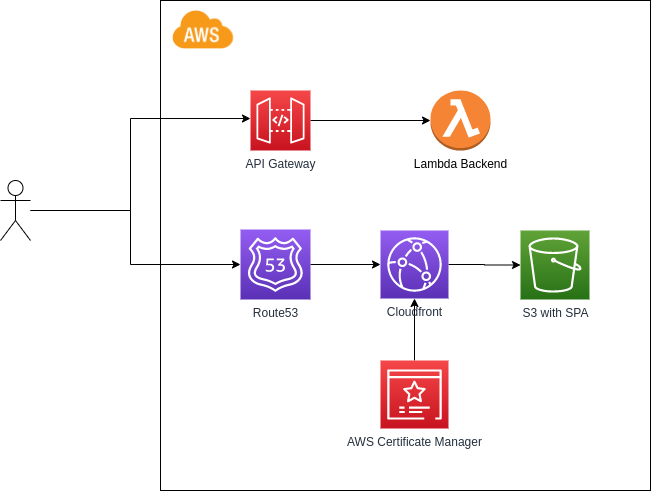

# SPA with AWS CDK in Typescript

## Introduction
This repo contains AWS resources in AWS CDK (Typescript) that will deploy in HTTPS a simple React application stored in S3 and fronted by Route53 and Cloudfront distribution. The backend uses an API Gateway and a Lambda function. You can find the overall architecture here below. You should have already a domain name and a Hosted Zone for it in Route53. TLS termination happens at the CloudFront distribution where the TLS certificate is configured for your domain. This repo will also create a TLS certificate in the region **us-east-1** which is a requirement for the ACM and CloudFront integration (See [this](https://docs.aws.amazon.com/AmazonCloudFront/latest/DeveloperGuide/cnames-and-https-requirements.html#https-requirements-aws-region) for further information).

## Architecture


## Get Started

### Prerequisites
  * CDK V2
  * npm +8.x.x
  * Nodejs +v16.x.x
  * AWS CLI pointing to your AWS profile.

### Deployment
1. Change the CDK context to meet your domain requirements. Go to [cdk.json](cdk.json) and change the variables **domain_name** and **subdomain_name**.
1. Install all dependencies.
```
npm install
```
2. Build the React app to be deployed in S3:
```
cd react-app/
npm install
npm run build
```
3. Make sure that there are 2 stacks for CDK:
```
cd ../
cdk list -c domain_name=<<your domain>>
```
4. Deploy the first stack **AwsCdkTsStack**. It will deploy the API gateway and Lambda Function. Take note of the API Gateway URL.
```
cdk deploy AwsCdkTsStack
```
5. Change the URL for the API Gateway in the [React app](react-app/src/App.js) and build again the app.
```
cd react-app/
npm run build
```
6. Deploy the second stack **AwsCdkStaticContent**.
```
cd ../
cdk deploy AwsCdkStaticContent
```

After it is deployed, your app should be available at **https://<your_subdomain>.<your_domain>**

### Clean up
```
cdk destroy --all
```

### Improvements
List of improvements but not limited to:
* Automate the manual step to copy the API gateway URL from one stack to the other!!! (Currently it needs two builds of the app to deploy the stacks).
* CICD Pipeline.